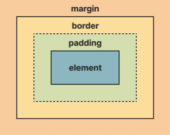

# 20230707 정리

---

## CSS 선택자 우선순위

```
* CSS의 순서 규칙
계단식(Cascade) 및 우선 순위(Specificity)
```

### 1. 후자우선의 원칙

```css
p {
  color: red;
  font-size: 20px;
}
p {
  color: blue;
}
/* 실행하면 색깔은 blue의 크기가 20px인 결과가 나온다. */
/* CSS의 정의 */
```

---

### 2. 구체성의 원칙(Specificity: 명시도)

```html
<p class="hello">안녕하세요.</p>
```

```css
p.hello {
  color: #eee;
}
.hello {
  color: yellow;
}
p {
  color: green;
}
/* CasCade의 성질을 가지고 있어도 태그에 대하여 상세하게 작성한 CSS가 적용된다. 정답은 #eee의색 글자가 출력된다. */
```

#### 1. 가중치 순서 및 우선 순위 계산

|               태그               | 점수 |
| :------------------------------: | :--: |
|              inline              | 1000 |
|             `id(#)`              | 100  |
| `class(.),가상클래스,속성선택자` |  10  |
|       타입,가상요소 선택자       |  1   |
|         `전체 선택자(*)`         |  0   |

```css
div #id1 {
  color: green;
}
p#id1 {
  color: black;
}
#id1 {
  color: blue;
}
.class {
  color: yellow;
}
```

```html
<div>
  <p id="id1" class="class">1. 무슨 색</p>
  <p id="id2" class="class" style="color:red">2. 무슨 색</p>
</div>
<!-- 1. 초록  2.빨강  
1번은 유형선택자와 id가 같이 쓰여 정밀하게 선택하여 초록색이 나온다.
2번은 inline이기 때문에 p태그안에 속성값이 적용-->
```

```css
/* 클래스 + 유형 선택자 */
.ul a {
  color: yellow;
}
/* 클래스 선택자 */
.click {
  color: green;
  background: black;
}
/* 유형 선택자 */
html body main section article div ul li p strong span a {
  background: purple;
  color: blue;
}
```

```html
<body>
  <main>
    <section>
      <article>
        <div>
          <ul class="ul">
            <li>
              <p>
                <strong>
                  <span>
                    <a href="#" class="click">
                      1. 이 글자는 어떤 색일까요? 2. 배경색은 어떤 색일까요?
                    </a>
                  </span>
                </strong>
              </p>
            </li>
          </ul>
        </div>
      </article>
    </section>
  </main>
</body>

<!-- 정답은 글자 노란색, 배경 검정색이다. 
유형선택자와 같은 경우 정말 상세하게 작성하였지만 클래스선택자의 가중치가 더 높기 떄문이다.-->
```

---

### 3. 중요성의 원칙

- `!important` (CSS): 선택자 아무리 많더라도 !important를 작성하게 된다면 최고 순위가 된다. 오류와 버그가 많아서 권장하지 않음.

---

## Block 레벨 요소와 Inline 레벨 요소

### 1. Block

- 부모 요소의 전체 공간을 차지하는 블록 생성
- 좌우 최대한 늘어나 모든 너비를 차지
- 이전 이후 요소 사이에 줄을 바꾼다.
- 페이지를 구조적으로 나타낼 때 사용한다.
- Block요소 안에 Inline요소가 사용이 되나 그 반대는 되지 않는다.
- `width`,`height`,`padding`,`border`,`margin` 속성을 사용할 수 있다.
- 대표적으로 `<div>`,`<p>`,`<nav>`,`<footer>` 등이 있다.

```html
<div>
  블록요소 안
  <span>인라인요소 중첩 가능</span>
</div>
<!-- 가능 -->

<span>
  인라인요소 안
  <div>블록요소 중첩 불가능</div>
</span>
<!-- 불가능 -->

<a href="”#”"><div></div></a>
<!-- Inline 요소 중 a태그는 블록 요소 중첩이 가능하다. -->
```

### 2. Inline

- 블록 레벨 요소 안에 포함된다.
- 자기가 필요한 공간만 할당을 받는다.(가로 증가)
- 문장, 단어를 사용하는데 적용된다.
- 새로운 줄을 생성하지 않는다.
- `width`,`height`는 크기 지정 불가
- `padding`,`border`,`margin` 속성은 사용 가능. 하지만 `margin`의 위, 아래 속성은 이용 불가능.
- `<a>`,`<em>`,`<strong>` 등이 있다.

### 3. Inline-Block

- Inline의 기능과 Block의 기능이 합해진 것이다.
- 할당받은 공간만 사용(가로 증가)
- Block과 똑같이 속성을 이용가능

---

## CSS Box Model

### 1. CSS Box Model

- HTML 요소를 감싸는 상자
- margin-border-padding-element 요소로 구성 되어있다.
  - `element`: 텍스트, 사진 등 보여줄 대상
  - `padding`: element를 감싼다.
  - `border` : padding 영역을 둘러쌓여있다.
  - `margin` : border 영역을 둘러쌓여있다.



#### width

- 너비를 의미
- 기본값은 콘텐츠 영역의 너비지만 `box-sizing` 속성을 사용하여 테두리 영역의 너비 설정
- `auto`: 기본값. 브라우저가 계산
- `min-content`: 최소 너비
- `max-content`: 컨텐츠 내용의 선호 너비
- `fit-content`: 컨텐츠의 너비 만큼

#### height

- 요소의 높이

#### padding

- 단축 속성이며, `padding-top` `padding-right` `padding-bottom` `padding-left` 순서로 작성해야함.(시계 방향 위->오른쪽->아래->왼쪽)

```css
p {
  padding: 10px; /* top, right, bottom, left 모두 10px */
  padding: 10px 20px; /* top, bottom :10px,  left, right:20px */
  padding: 10px 20px 30px; /* top:10px, left,right:20px, bottom:30px */
  padding: 10px 20px 30px 40px;
}
```

#### margin

- padding과 순서, 사용 방법은 같다.
- `margin: auto`를 하면 가운데 정렬이다.(위, 아래 정렬은 되지 않음)

#### margin 병합 현상(Margin Collapsing)

- element와 element 사이의 서로 겹치게 margin 값을 주었을 때, margin값을 더 큰 것만 적용되는 현상
- 부모 요소와 자식 요소에서도 자식 margin 값이 부모 높이보다 더 큰 값을 주었을 떄, 영향을 주지 않는다.
- margin 병합 현상 해결 방법
  1. 부모 요소에 `overflow` 속성 값 적용
  2. 부모 요소에 `display: inline-block`값 적용
  3. 부모 요소에 `border`값 적용
  4. 부모 요소에 `display:flow-root`를 사용(IE 지원 불가)

```
margin 병합 현상에 대해 인지하고 구현을 하였다면 구현에 대해 상관없다.
```

#### border

- 테두리를 지정
- 테두리는 요소가 차지하는 전체 너비, 높이의 일부
- `border-width` `border-style` `border-color`를 지정

#### box-sizing

- `content-box`: 기본값. `width`,`height`에 `border`,`margin` 포함하지 않음.
- `border-box`: width = 콘텐츠 너비 + border + padding

#### overflow, overflow-x, overflow-y

- 박스보다 컨텐츠가 더 클 떄, 처리하는 방법 지정
- `visible`: 박스보다 클 떄, 컨텐츠를 자르지 않는다.
- `hidden`: 내용 크기만큼 맞추고 나머지를 자른다.(스크롤바 x)
- `scroll`: 내용 크기만큼 자르고 스크롤 제공
- `auto`: 자동으로 콘텐츠를 넘칠 경우 스크롤바 노출

#### border-radius

- 상자 모양을 조절

#### background

- `background-attachment`
  1. `fixed`: 뷰포트고정
  2. `local`: 콘텐츠에 대해 고정. 스크롤이 존재하면 배경과 함께 스크롤
  3. `scroll`: 배경 요소는 고정. 배경은 함께 스크롤이 되지 않음.
- `background-clip`: 요소의 배경이 테두리, 안쪽 여백, 콘텐츠 상자 중 어디까지 차지할지 지정
  - 배경을 잘라냄
  - `border-box`/`padding-box`/`content-box`
- `background-origin`: 배경 위치 시작점을 결정
- `background-color`: 배경 색상 설정
- `background-image`: 배경 이미지 설정
- `background-position`: 배경의 위치를 설정
- `background-repeat`: 배경 이미지를 어떻게 반복할 것인지 설정
  1. `repeat`: 반복
  2. `no-repeat`: 반복x
  3. `repeat-x` : x축 반복
  4. `repeat-y` : y축 반복
- `background-size`
- `contain` : 이미지가 잘리거나 찌그러지지 않도록 임계치 중 제일 크게 설정. 여백이 발생할 수 있다.
- `cover` : 이미지가 찌그러지지 않는 임계치 중 제일 크게 설정. 이미지의 가로세로비가 요소와 다르다면 이미지를 세로 방향 또는 가로 방향으로 잘라내어 여백이 생기지 않도록 설정.
- 별도 크기 지정

```
* 배경으로 사용할 경우 background, 화면에 사진을 넣을 경우  태그 사용을 권장
```

```css
div {
  background: skyblue url(img/bg.jpg) no-repeat 50% 50% / center;
  /* 색, 이미지 경로, 반복형태, 가로, 세로, 위치 */
  background-clip: padding-box;
  /* 꼭 background-clip 사용시, background 태그 사용 후 사용 */
}
```

#### box-shadow

- 그림자 효과를 제공
- `inset`이라는 속성 값은 박스 내부에 그림자를 넣음

#### opacity

- 불투명도를 설정
- 0~1사이의 숫자만 지정(0:투명 1: 불투명)

---

## display 속성

- 박스를 다른 박스와 어떻게 배치할지 결정하는 설정

```
* 주의사항: 시각적인 요소만 바뀌는 것. Block레벨이 바뀌는 것은 아님.
```

- `block`: 요소 전후에 줄 바꿈
- `inline`: inline요소 상자를 생성. 공간이 있으면 가로 배치
- `inline-block`: inline과 같이 가로 배치. block의 box-model의 width, height, margin, padding 모두 설정
- `flex`: 내부 자식 요소들의 위치를 부모 컨테이너 요소 안에서 x, y축 단방향(1차원적)으로 설정합니다.
- `grid`: 내부 자식 요소들의 위치를 부모 컨테이너 요소 안에서 x, y축 모두 이용해(2차원적) 설정합니다.
- `none`: 해당 속성은 접근성 트리에서 해당 요소가 제거됩니다. 이렇게 되면 해당 요소 및 해당 하위 요소가 사라지고, 스크린리더에도 읽히지 않습니다.

---

## reset.css

- 각 브라우저 마다 기본적으로 제공하는 스타일
- 브라우저마다 조금씩 다르다.

### 크로스 브라우징(Cross Browsing)

- 웹페이지의 상호 호환성
- 어느 한쪽에 최적화되어 치우치지 않도록 공통 요소를 사용여 웹페이지를 제작하는 기법
